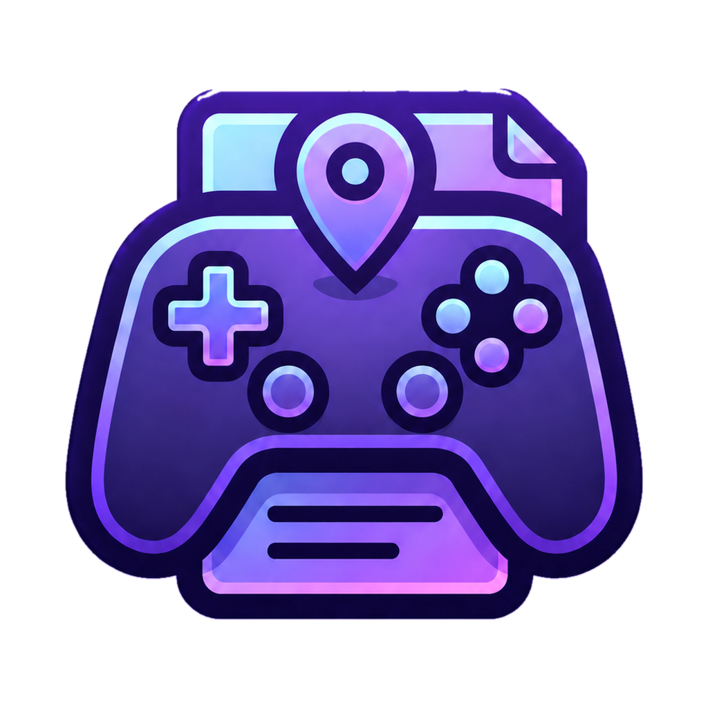
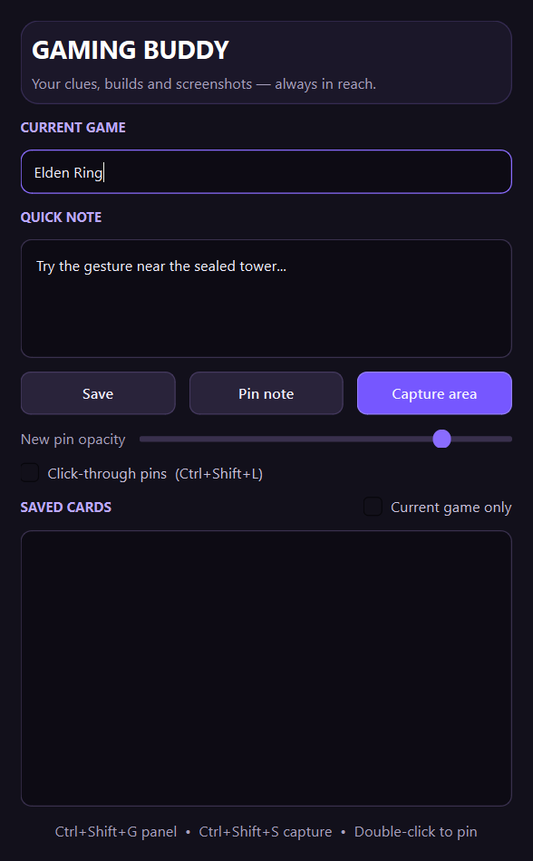

# Gaming Buddy

<p align="center">
  
</p>

Gaming Buddy is a lightweight Windows overlay for saving notes and pinning cropped
screenshots without leaving a game. This repository contains the first working prototype.




## About the project

Gaming Buddy keeps useful game information visible while you play. It provides a compact
control panel for capturing a clue, saving a short note, and placing movable cards over a
game window. The prototype is designed for quick interaction and stores its data locally.

## Prototype features

- Capture a region of any screen and pin it above the game
- Create, save, and pin quick text notes
- Move and resize every pinned card
- Adjust overlay opacity
- Switch pins into click-through mode
- Organize cards by game name
- Persist everything locally in SQLite
- Global shortcuts and a system tray menu
- No code injection and no game-memory access

## Shortcuts

| Shortcut | Action |
| --- | --- |
| `Ctrl+Shift+G` | Show or hide the control panel |
| `Ctrl+Shift+S` | Capture a screen region |
| `Ctrl+Shift+L` | Toggle click-through mode for all pins |

## Run from source

Windows and Python 3.11 or newer are required.

```powershell
git clone https://github.com/YOUR_USERNAME/gaming-buddy.git
cd gaming-buddy
py -m venv .venv
.venv\Scripts\Activate.ps1
python -m pip install -e ".[dev]"
gaming-buddy
```

You can also run it without installing the command:

```powershell
python -m gaming_buddy
```

## How to use

1. Enter the current game name in the top field.
2. Write a note and choose **Save** or **Pin note**.
3. Choose **Capture area**, drag around a clue or map, and release.
4. Drag pins by their header and resize them from the bottom-right corner.
5. Enable **Click-through pins** so mouse input goes to the game.

Captured images and the SQLite database are stored under:

```text
%LOCALAPPDATA%\GamingBuddy
```

## Project structure

```text
gaming-buddy/
├── src/gaming_buddy/
│   ├── app.py          # Application entry point
│   ├── dashboard.py    # Main control panel
│   ├── capture.py      # Screen-region capture
│   ├── pin.py          # Movable overlay cards
│   ├── hotkeys.py      # Global keyboard shortcuts
│   └── storage.py      # Local SQLite persistence
├── tests/              # Automated storage and path tests
└── docs/               # Project preview assets
```

## Privacy and storage

- Notes and captured images remain on the user's computer.
- The prototype does not require an account or cloud connection.
- Captures are created only after the user activates the capture shortcut.
- Saved data can be removed by deleting `%LOCALAPPDATA%\GamingBuddy`.

## Compatibility and fair-play note

The MVP uses ordinary top-level Windows windows. It does not inject code, read game
memory, automate input, or bypass anti-cheat software. Borderless-windowed mode gives
the most reliable overlay experience. Some exclusive-fullscreen games may hide normal
desktop overlays. Always follow the rules of the game you are playing.

## Current scope and roadmap

This release intentionally focuses on the core overlay and notebook experience. Planned
improvements include text recognition, spoiler-safe layered hints, optional web lookup,
better multi-monitor support, import/export, and a Windows installer.

## Development

```powershell
python -m pytest
python -m ruff check .
```

## Ownership and license

Copyright © 2026 **Amir Ali Mirab Zadeh Ardekani**. All rights reserved.

This is proprietary software. The source is available for viewing, but copying,
modification, redistribution, commercial use, or creation of derivative works is not
permitted without prior written authorization. See [LICENSE](LICENSE) for the complete
terms.
